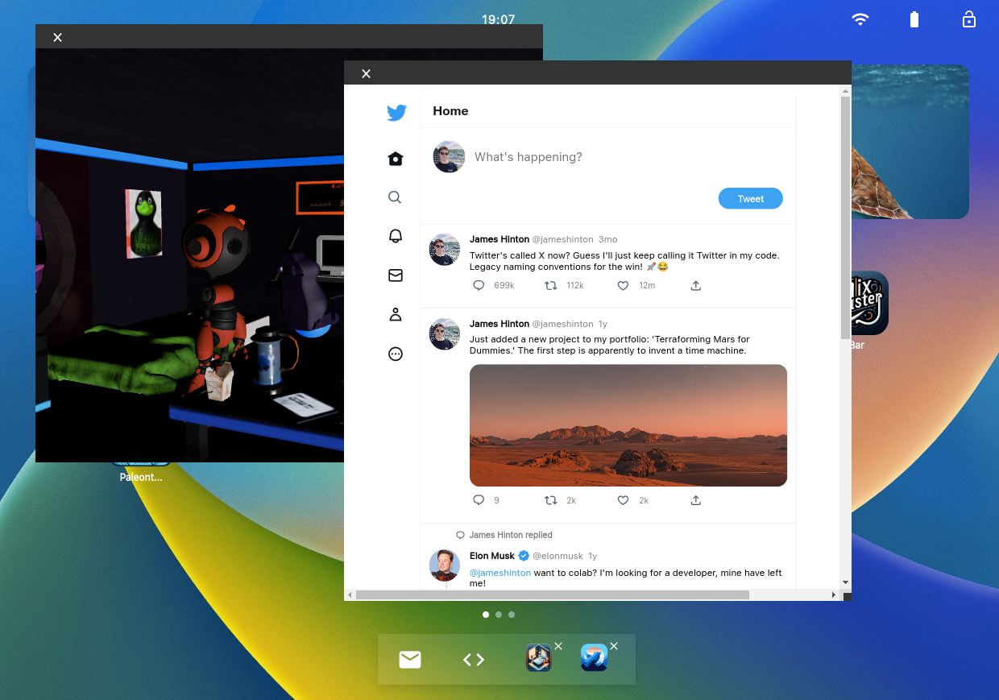
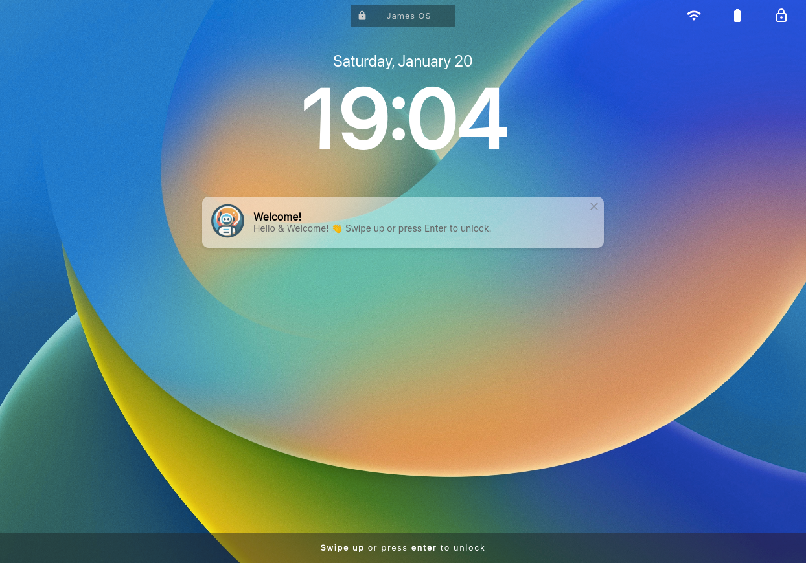
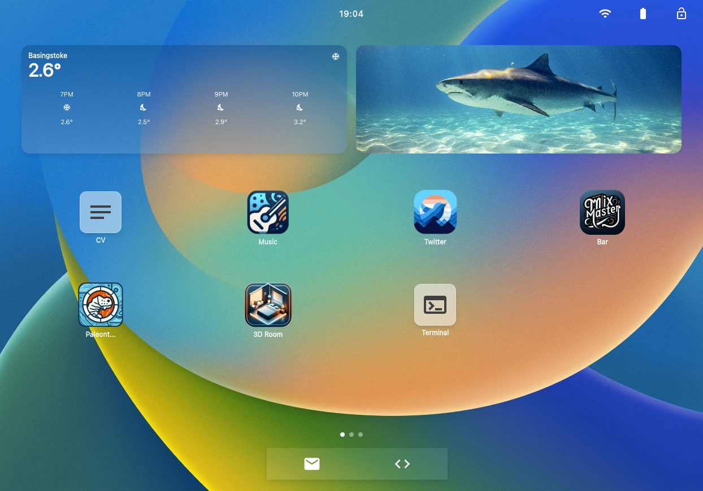

# James OS
Check it out [james-hinton.com](https://www.james-hinton.com/)
Personal portfolio that simulates an operating system in a web environment.

## Showcase

### Multi-Window Support

### Lock Screen

### Home Screen

## Apps

- **3D Explorable Bedroom (React Three):** A fully interactive 3D bedroom environment
- **Twitter Recreation:** A functional clone of Twitter
- **SoundCloud Replica:** A version of SoundCloud
- **Cocktail Bar:** Featuring every cocktail from a scraped book database, offering a comprehensive guide to cocktail recipes.
- **Paleontology Fossil Map Finder:** An interactive map for fossil enthusiasts, pinpointing various paleontological sites.
- **Funny Fake Terminal:** A mock terminal where users can enter commands for humorous responses.
- **CV/Resume:** A digital version of my professional CV/Resume
- **Chatbot Emailer:** A chatbot that users can interact with, which sends me email notifications of the conversations.
- **Live Weather App:** Providing real-time weather updates and forecasts.
- And many more!